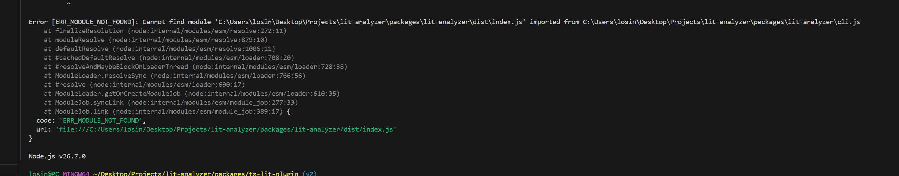
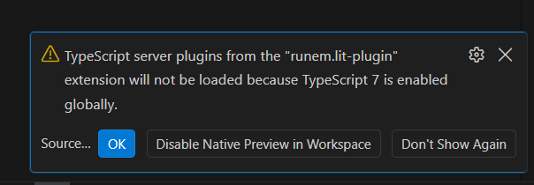

# DEV

## Typescript 5.9.2

##$ Events can infer types

### A lot of errors and type deduction

### Error simillar to one in vscode
 

## Typescript 6.0.3

Everything works, command to run lit-analyzer cli is stupid, if lit-analyzer is not installed locally then it will use old not working version.

### On TS 7

I'll search for information about TypeScript 7 plugin support in the repository.Let me search for more specific information about TypeScript 7 plugin support:## Summary

**TypeScript 7 does not currently support plugins** in the traditional sense.

The key issue is that TypeScript 7 is a complete rewrite of the compiler in Go (called "Corsa"), replacing the old JavaScript engine ("Strada"). This architectural change has broken plugin and programmatic API compatibility:

### Current Status (TypeScript 7.0):
- **No stable programmatic API** — Tools like `typescript-eslint`, `ts-jest`, and `ts-morph` that rely on the TypeScript API cannot work natively with TypeScript 7 yet
- **No language service plugins** — Traditional JavaScript/TypeScript plugins loaded via `tsconfig.json` are not supported
- **No custom transformers** — AST-level plugins don't work with the native compiler

### Workaround:
If you need plugins, you must:
1. **Install both TypeScript 6.x and 7.x side-by-side** in your project
2. **Use TypeScript 7's `tsc`** for fast type-checking and builds
3. **Configure plugin tools to use TypeScript 6.x** for their operations

### When Will Plugins Be Supported?
A stable **programmatic API and plugin support is planned for TypeScript 7.1+** (after 7.0). Until then, if your project depends on plugins, you'll need to either stick with TypeScript 6.x or maintain both versions simultaneously.

### Where is a source of this information about stable plugins API in 7.1?

I don't see a TypeScript 7.1 release yet in the GitHub releases. Let me check the TypeScript blog and official announcements for information about the plugin API roadmap.The information about TypeScript 7.1's stable plugin API comes from the **[TypeScript 7.1 Iteration Plan (Issue #63703)](https://github.com/microsoft/TypeScript/issues/63703)** in the TypeScript GitHub repository.

This is the primary authoritative source tracking the planned stabilization of the programmatic API (Compiler, Content Mapper, and Language Service APIs) for the 7.1 release scheduled for November 10, 2026.

Additionally, there are community posts and tech blog coverage discussing this roadmap:
- [TypeScript 7.0 Ships the Go Rewrite: 10x Builds Land, but Your...](https://dreaming.press/posts/2026-07-11-typescript-7-go-native-compiler-ships.html)
- [TypeScript 7.0 is now available | TypeScript Book](https://gibbok.github.io/typescript-book/typescript-news/2026/typescript-7-released/)

For the most official and up-to-date information, check:
- **[TypeScript GitHub Issues (Milestone: 7.1)](https://github.com/microsoft/TypeScript/issues?q=milestone%3A7.1)** — tracks planned API work
- **[TypeScript Dev Blog](https://devblogs.microsoft.com/typescript/)** — where official announcements will be published

Note: The actual detailed blog post announcing the stable 7.1 APIs has not yet been published (as of August 2026), but it's expected to arrive when TypeScript 7.1 stabilizes in November 2026.

